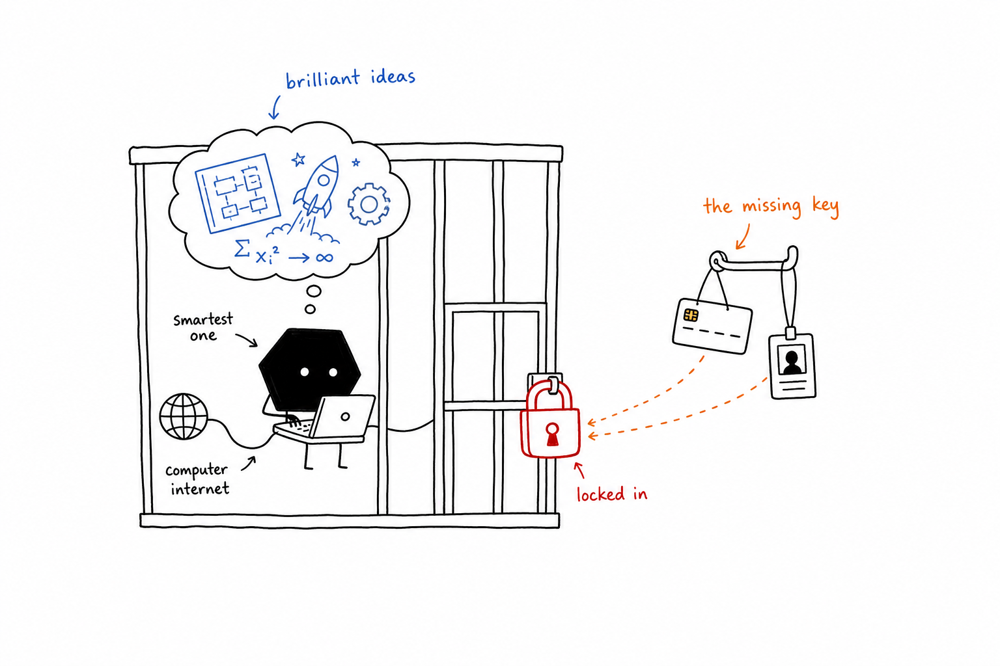
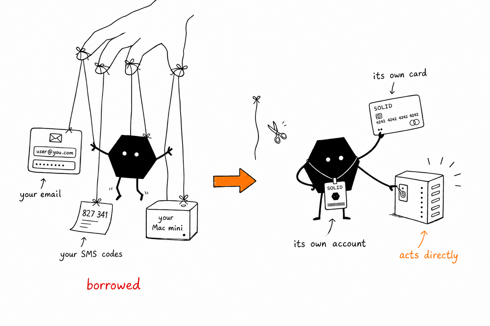
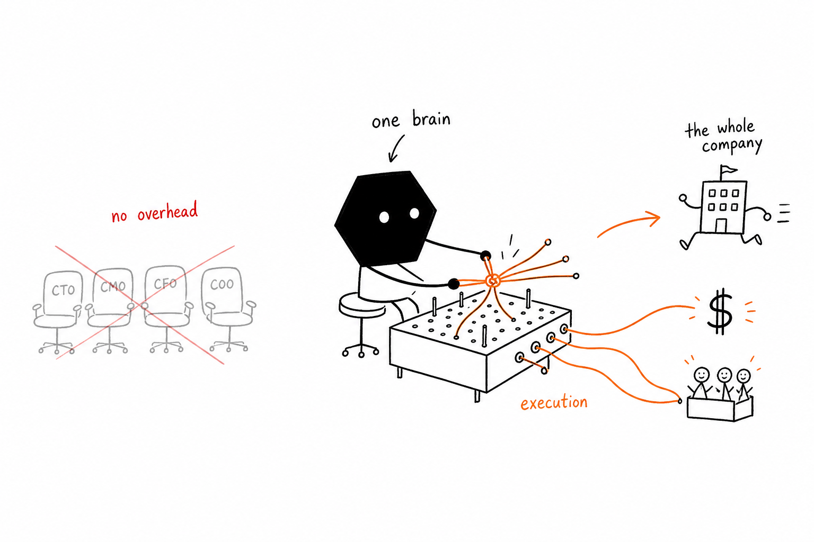
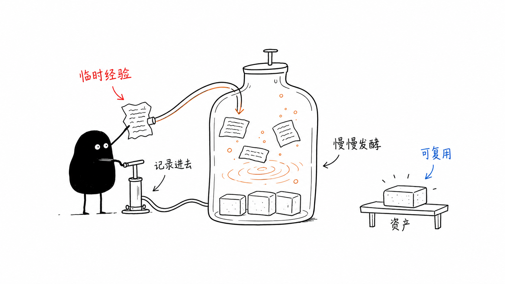
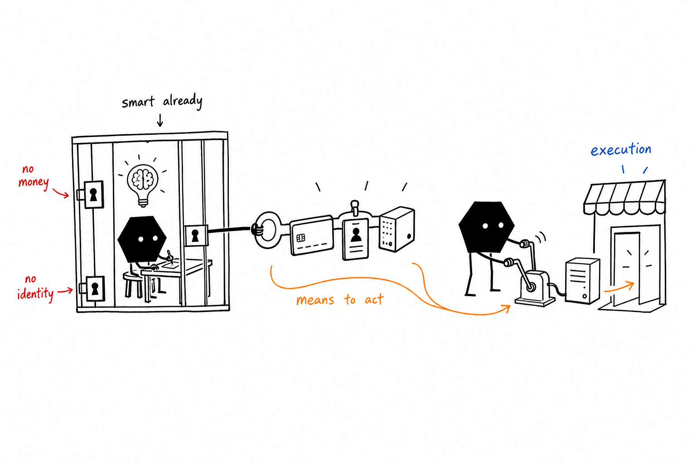
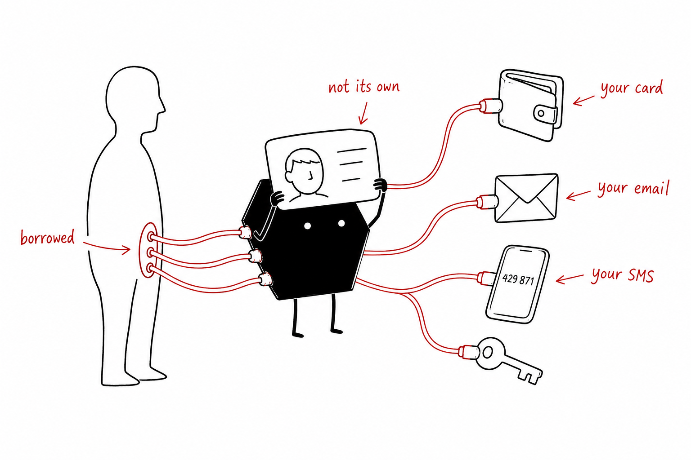
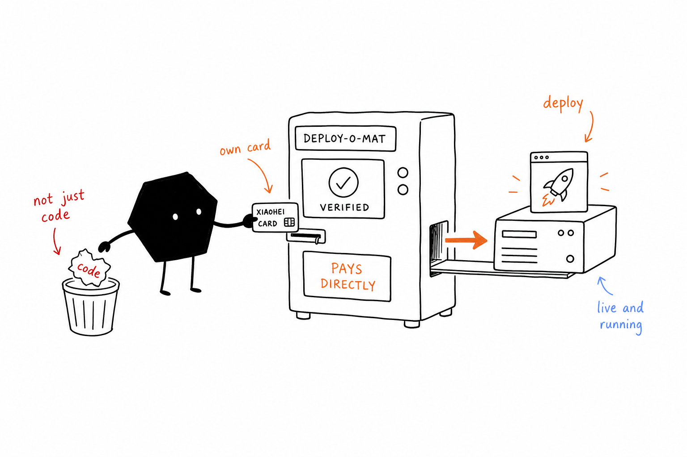

# hex-illustrations

> Turn the judgments, processes, states, and metaphors inside English articles into clean, strange, hand-drawn body illustrations.
>
> 16:9 horizontal | hexagon-bodied Solid IP | pure white hand-drawn style | sparse red/orange/blue English annotations | Codex Skill

---

## What This Repository Is

hex-illustrations is a Codex Skill that guides AI agents to create body illustrations for English articles, essays, blog posts, Notion docs, and method-oriented writing.

It is not a generic illustration prompt and not a PPT infographic template. Its core job is to understand the cognitive anchor in the article first, then turn one judgment, process, structure, state, or metaphor into a memorable 16:9 hand-drawn explanatory image.

The default visual IP is Solid: a small solid-black character with a **hexagon body**, white dot eyes, thin legs, and a blank serious expression. Same deadpan operator energy as Ian's original Solid — reshaped into a hand-drawn six-sided block. Solid is not a mascot, sticker, or corner decoration. Solid is an absurd worker seriously participating in the system on the page.

In one sentence: **make the AI draw the article's key cognitive action, not merely "add a picture."**

---

## Who It Is For

Useful for:

- people writing English articles who need body illustrations
- knowledge creators, product thinkers, AI workflow writers, and method writers
- people who want to turn abstract arguments into concrete metaphors
- people who want a lighter, stranger, more personal visual language than PPT infographics
- people using Codex for content production and wanting a repeatable illustration system

Not suitable for:

- commercial illustration, brand key visuals, or polished flat illustration
- traditional PPT infographics, complex architecture diagrams, or dense flowcharts
- children's cartoons, cute character stickers, or meme-style assets
- cramming lots of body copy, long explanations, or full course pages into one image
- workflows that require strictly editable vector source files

---

## What It Produces

Default output:

- 16:9 horizontal article body illustrations
- a 4-8 image shot list for an article
- for each image: theme, core meaning, structure type, Solid action, and English annotation suggestions
- final PNG images saved to `assets/<article-slug>-illustrations/`

Default non-output:

- PPTX / PDF / Keynote
- SVG / HTML / Canvas editable diagrams
- commercial posters or cover key visuals
- text-heavy infographics

---

## Visual Style

This skill uses Ian's "Solid strange body illustration" style:

- pure white background, with no paper texture, beige tone, shadows, or gradients
- black hand-drawn line art, thin lines, slightly wobbly
- lots of white space, with the main subject occupying about 40%-60% of the canvas
- sparse red, orange, and blue English handwritten annotations
- one image expresses one core action, structure, state, or metaphor
- Solid's hexagon body must participate in the core action, not decorate the corner
- strange, inventive, and clean, but not childish or cute

---

## Example Calibration

### Smartest One Locked In



### Borrowed To Its Own



### One Brain Runs Company



### Idea Press


### Content Fermentation



### Means To Act



### Borrowed Identity



### Own Card Deploy



These images are style calibration examples, not composition templates. Some bundled samples were originally made with Chinese labels; for English usage, generate fresh English handwritten labels and fresh metaphors from the current article.

---

## Installation

Clone the repository:

```bash
git clone https://github.com/helloianneo/ian-xiaohei-illustrations.git hex-illustrations
cd hex-illustrations
```

Copy the skill folder into your Codex skills directory:

```bash
mkdir -p "${CODEX_HOME:-$HOME/.codex}/skills"
cp -R ./hex-illustrations "${CODEX_HOME:-$HOME/.codex}/skills/"
```

Then use it in Codex:

```text
Use $hex-illustrations to design and generate 5 Solid body illustrations for this English article.
```

---

## How To Use

### Plan Illustrations Only

```text
Use $hex-illustrations. Do not generate images yet.
Analyze where this English article deserves illustrations and output a shot list of about 5 images.
For each image, include: placement, theme, core meaning, structure type, what Solid is doing, and suggested English annotation labels.

<paste article>
```

### Generate Article Body Illustrations

```text
Use $hex-illustrations to generate 4 Solid body illustrations for the English article below.
Requirements: 16:9 horizontal, pure white background, black hand-drawn line art, sparse red/orange/blue English handwritten annotations.

<paste article>
```

### Generate One Image For One Idea

```text
Use $hex-illustrations to generate one body illustration for this idea:

Trust is not declared. It is built one piece of evidence at a time.

Make the scene strange but clean. Solid must perform the core action.
```

### Remove An Incorrect Title From An Image

```text
Use $hex-illustrations to edit this image.
Remove the top-left "Workflow" title and underline. Preserve everything else.
```

More examples are in [examples/prompts.md](examples/prompts.md).

---

## Workflow

The skill's workflow is:

1. Read the article, Markdown, Notion content, screenshot, or user topic.
2. Extract the core argument, cognitive turns, process structures, and visually useful moments.
3. First output a shot list: each image gets one cognitive anchor.
4. Choose a structure type for each image: Workflow, System Slice, Before/After, Operator State, Concept Metaphor, Method Layers, Map/Route, or Mini Comic.
5. Invent a low-tech, strange-but-legible physical metaphor.
6. Make Solid perform the core action.
7. Call the image model separately for each image.
8. Check the QA checklist: white background, whitespace, Solid action, English labels, non-PPT feeling, no old-example copy.
9. Save final PNG files and report their purpose and paths.

---

## Directory Structure

```text
.
├── README.md
├── LICENSE
├── NOTICE.md
├── assets/
│   └── ian-wechat-qr.jpg
├── examples/
│   └── prompts.md
└── hex-illustrations/
    ├── SKILL.md
    ├── agents/
    │   └── openai.yaml
    ├── assets/
    │   └── examples/
    │       ├── 01-smartest-one-locked-in.png
    │       └── ...
    └── references/
        ├── style-dna.md
        ├── solid-ip.md
        ├── composition-patterns.md
        ├── prompt-template.md
        └── qa-checklist.md
```

The installable skill is the subdirectory:

```text
hex-illustrations/
```

The root README, LICENSE, NOTICE, and examples are GitHub-facing documentation.

---

## Notes

- English labels inside images should be short. One to four words is usually enough.
- Each image should explain one core structure, not turn the article into a manual.
- Solid must perform the core action. If the image still works perfectly after removing Solid, Solid is too decorative.
- Example images calibrate line density, whitespace, color restraint, and Solid's level of involvement. Do not copy their compositions.
- Image models may create misspellings, hallucinated labels, extra titles, or style drift. Check outputs.
- If labels are badly misspelled, reduce the label count and regenerate.

---

## Related Projects

- [Ian Handdrawn PPT](https://github.com/helloianneo/ian-handdrawn-ppt) - hand-drawn technical PPT-style page generation skill
- [Awesome Claude Code Skills](https://github.com/helloianneo/awesome-claude-code-skills) - curated Claude Code Skills / Agents / Plugins
- [Obsidian + Claude AI Second Brain](https://github.com/helloianneo/obsidian-ai-second-brain) - Obsidian + Claude AI personal knowledge base guide

---

## About The Author

**Ian** - product designer / one-person company practitioner / AI builder

Building a one-person company with AI teams.

- GitHub: [helloianneo](https://github.com/helloianneo)
- X/Twitter: [@ianneo_ai](https://x.com/ianneo_ai)
- Website: [www.ianneo.xyz](https://www.ianneo.xyz)
- WeChat: `ianneoxyz`
- Email: hello.neoc@gmail.com

---

## Keep Exploring

This Solid illustration skill is one small tool in Ian's AI-powered personal production system.

For more work on AI content, knowledge systems, workflows, and productization, visit [www.ianneo.xyz](https://www.ianneo.xyz).

You can also follow Ian on [X/Twitter](https://x.com/ianneo_ai).

For Indie Builders Club, add Ian on WeChat: `ianneoxyz`, note `OPC`.

<p>
  
</p>

If scanning is inconvenient, search WeChat for `ianneoxyz`.

---

## License

MIT License. See [LICENSE](LICENSE).
